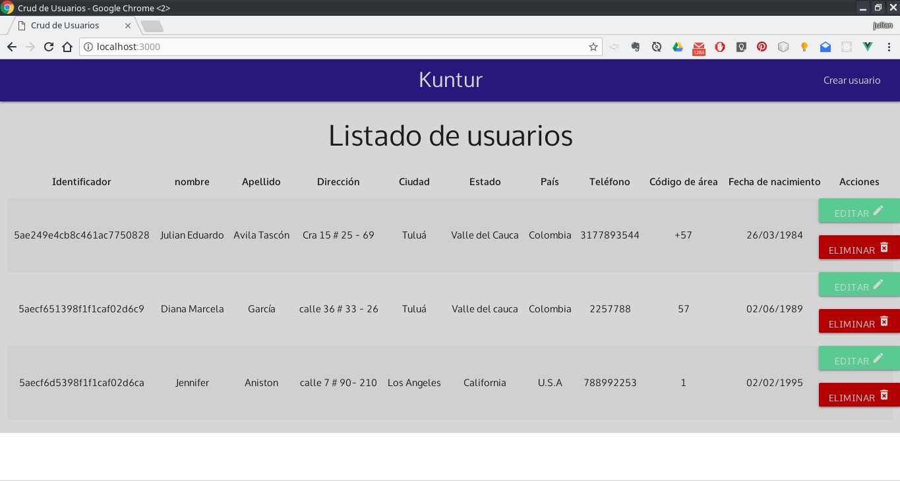
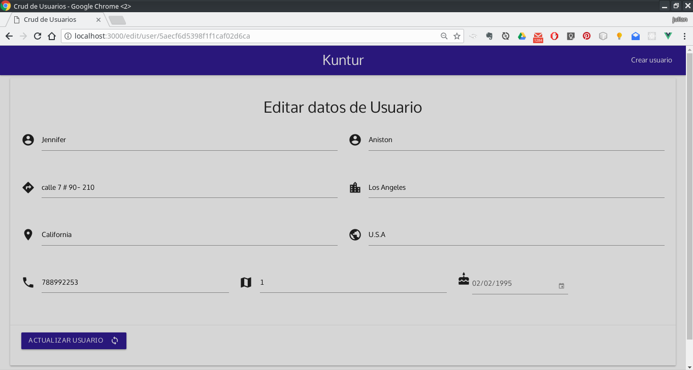

# Crud de Usuarios

Aplicación web responsiva, construida con el **stack MEVN** (Mongodb, Express, Vue.js Node.js)
esta aplicación se basa en listar, crear, editar y eliminar usarios

## Requisitos
- Nodejs
- MongoDB

## Instalación y Ejecución

- Descargar o clonar el repositorio ``git clone https://github.com/avilajul/crud_nodejs.git``
- Ingresar a la carpeta raíz del repositorio cd PlayOne
- Instalar las dependencias con el comando ``npm install``
- Construir webpack con el comando ``npm run build``
- Después de la instalación de depencias se corre la apliación con el comando ``npm start``.
Se abre una navegador y escribe la url http://localhost:3000

## capturas de pantalla

- Vista principal
- 

- Creación de usuario
- 

- Edición de usuario
- 